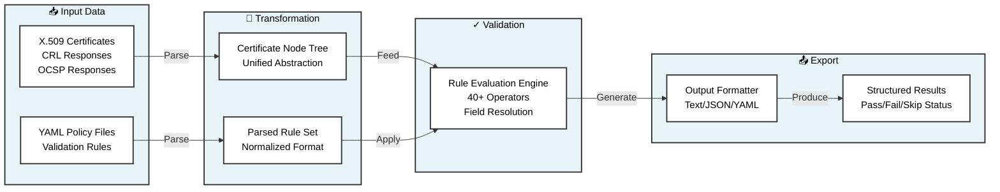

# PCL Architecture

**Policy-based X.509 Certificate Linter** — A modular system for validating X.509 certificates against configurable YAML-based policies.

---

## Data Flow Pipeline

The system processes data through a well-defined pipeline: raw certificate data and policies are transformed into a unified representation, validated against rules, and finally formatted for presentation.

---

## Key Components

| Component | Purpose |
|-----------|---------|
| **Data Acquisition** | Load certificates from files, directories, or HTTPS endpoints |
| **Policy Engine** | Parse YAML policies and extract validation rules |
| **Evaluation Engine** | Apply rules to certificates using a registry of 40+ operators |
| **Certificate Abstraction** | Unified node-tree representation for flexible field access |
| **Output Formatter** | Generate results in text, JSON, or YAML format |
